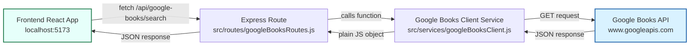
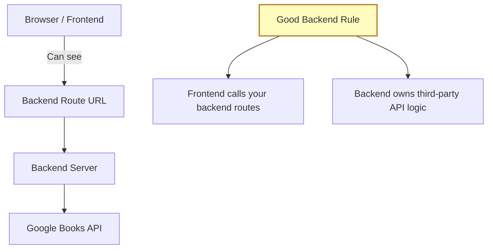
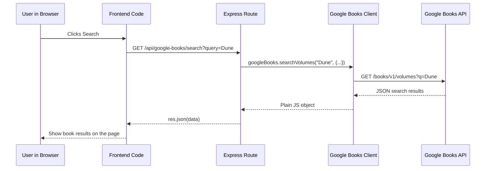
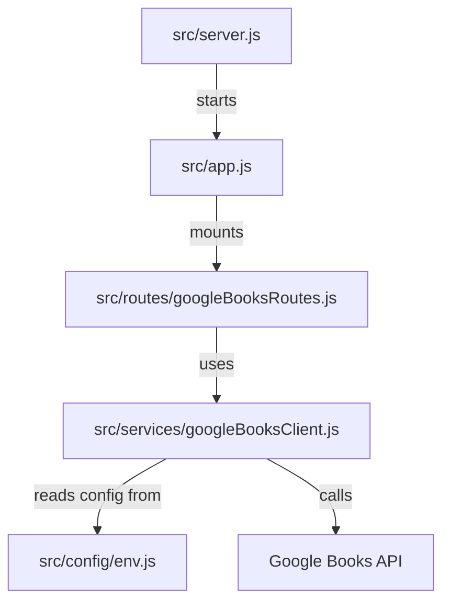

# Google Books API Flow Diagram

This page shows how the Google Books backend works in a visual way.

The most important idea is:

- the frontend asks the backend
- the backend asks Google Books

## Big Picture



## Security View



## Step-By-Step Request Flow



## What Each File Does



### 1. Frontend

The frontend is the React app. It should use `fetch()` to call a backend route, like:

```js
fetch("http://localhost:3000/api/google-books/search?query=Dune");
```

### 2. Route

The route is the backend URL that listens for the frontend request.

Example:

```text
/api/google-books/search
```

That route lives in:

```text
src/routes/googleBooksRoutes.js
```

### 3. Service

The service is the file that actually knows how to talk to Google Books.

That file lives in:

```text
src/services/googleBooksClient.js
```

It sends the real request to Google Books.

## Why This Is Better Than Calling Google Books Directly From The Frontend

- We can change Google Books logic in one backend place.
- The frontend only needs to learn our own app routes.
- This is closer to how production apps are usually built.
