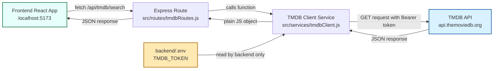
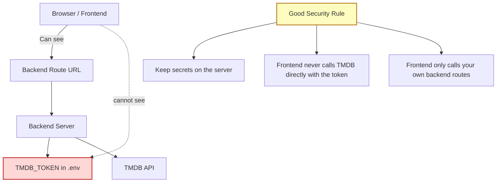
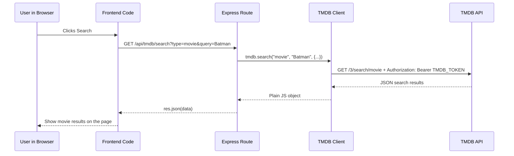
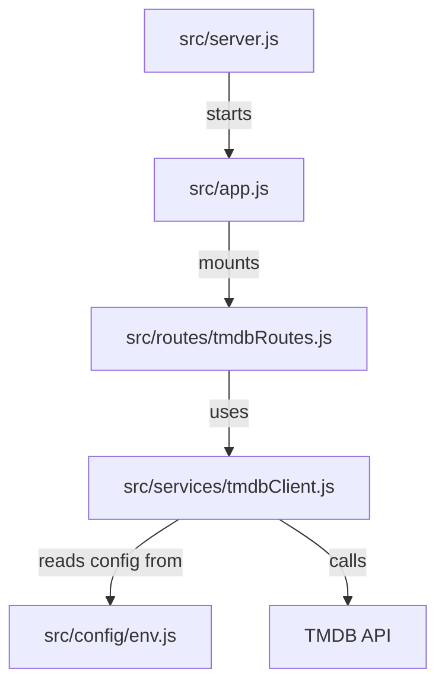

# TMDB API Flow Diagram

This page shows how the TMDB backend works in a visual way.

The most important idea is:

- the frontend asks the backend
- the backend asks TMDB
- the secret TMDB token stays in the backend

## Big Picture



## Security View



## Step-By-Step Request Flow



## What Each File Does



### 1. Frontend

The frontend is the React app. It should use `fetch()` to call a backend route, like:

```js
fetch("http://localhost:3000/api/tmdb/search?type=movie&query=Batman");
```

### 2. Route

The route is the backend URL that listens for the frontend request.

Example:

```text
/api/tmdb/search
```

That route lives in:

```text
src/routes/tmdbRoutes.js
```

### 3. Service

The service is the file that actually knows how to talk to TMDB.

That file lives in:

```text
src/services/tmdbClient.js
```

It adds the Bearer token and sends the real request to TMDB.

### 4. Secret Token

The token is stored in:

```text
backend/.env
```

That is safer because the browser never needs to see it.

## Why This Is Better Than Calling TMDB Directly From The Frontend

- The TMDB token stays private.
- We can change TMDB logic in one backend place.
- The frontend only needs to learn our own app routes.
- This is closer to how production apps are usually built.