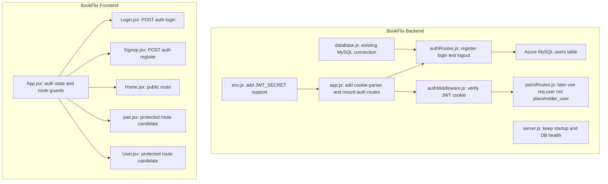
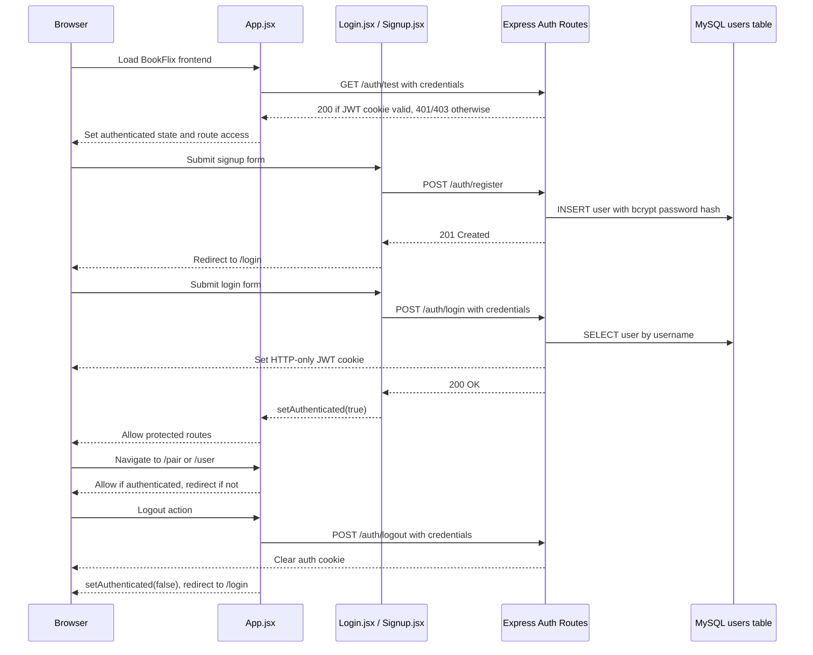
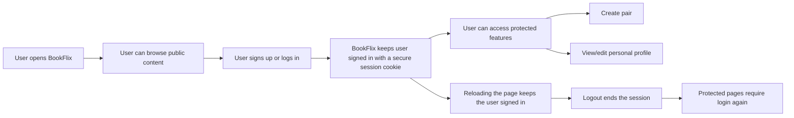
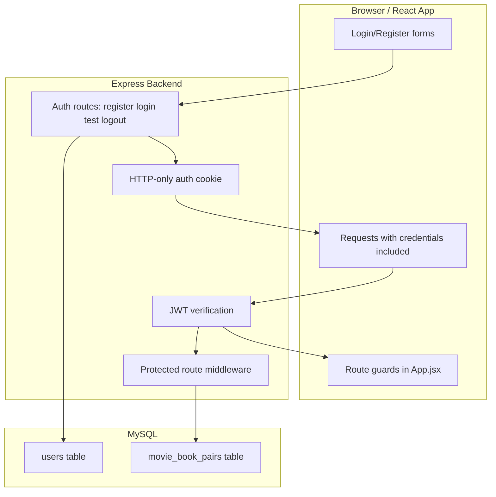
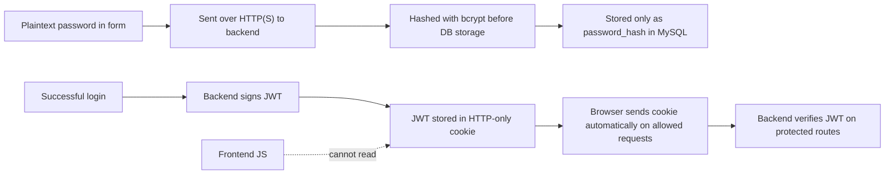

# BookFlix Sprint 2 Auth Integration Map

This document is retained as a historical implementation-planning artifact.
It does not describe the current docs layout, and some "still needs" items in this file have since been completed.

This file captures the current understanding of what still needs to be integrated into BookFlix to reach Sprint 2 authentication scope, using `xpostforecast/sprint2-login-backend` as the reference implementation.

## Summary

BookFlix already has:

- React/Vite frontend routing and pages
- Express backend structure
- Azure MySQL connection and SSL setup
- Existing `users` table in the configured database

BookFlix still needs:

- auth routes for register/login/test/logout
- cookie parsing and JWT support in the backend
- password hashing on registration
- session verification on frontend startup
- protected frontend routes
- real login/signup form submission
- logout flow
- optional route protection for pair creation and user profile pages

## File Mapping

| Reference Repo File | BookFlix Target File | Action | Purpose |
| --- | --- | --- | --- |
| `xpostforecast/.../backend/routes/auth.js` | `backend/src/routes/authRoutes.js` | Adapt | Register, login, session verify, logout |
| `xpostforecast/.../backend/middleware/authMiddleware.js` | `backend/src/middleware/authMiddleware.js` | Copy/adapt | Verify JWT from HTTP-only cookie |
| `xpostforecast/.../backend/server.js` | `backend/src/app.js` and `backend/src/server.js` | Adapt patterns only | Add cookie parser, mount auth routes, preserve existing startup structure |
| `xpostforecast/.../frontend/src/App.jsx` | `frontend/app/src/App.jsx` | Adapt | Manage `authenticated` state and route guards |
| `xpostforecast/.../frontend/src/pages/Login.jsx` | `frontend/app/src/pages/Login.jsx` | Adapt | Real login submit |
| `xpostforecast/.../frontend/src/pages/Register.jsx` | `frontend/app/src/pages/Signup.jsx` | Adapt | Real signup submit |
| N/A | `backend/src/config/env.js` | Extend | Add `JWT_SECRET` and any auth cookie config |
| N/A | `backend/package.json` | Extend | Add `bcryptjs`, `jsonwebtoken`, `cookie-parser` |
| N/A | `frontend/app/src/pages/pair.jsx` | Adapt | Optionally require auth before creating pairs |
| N/A | `frontend/app/src/pages/User.jsx` | Adapt | Optionally require auth and show current user |
| N/A | `backend/src/routes/pairsRoutes.js` | Future follow-up | Replace `placeholder_user` with authenticated user identity |

## Repo Integration Tree

## Runtime Auth Flow

## Implementation Order

```mermaid
flowchart LR
  A["1. Add backend auth deps"] --> B["2. Add JWT env support"]
  B --> C["3. Add authRoutes.js"]
  C --> D["4. Add cookie-parser and mount /auth"]
  D --> E["5. Add authMiddleware.js"]
  E --> F["6. Update App.jsx auth state"]
  F --> G["7. Wire Login.jsx"]
  G --> H["8. Wire Signup.jsx"]
  H --> I["9. Protect /pair and /user"]
  I --> J["10. Optional: attach logged-in user to pair saves"]
```

## Minimum Scope

For minimum Sprint 2 parity in BookFlix:

- implement backend auth endpoints
- wire cookie-based session verification
- make login and signup forms real
- guard protected routes
- support logout

For a good BookFlix-specific follow-up after minimum parity:

- use authenticated username instead of `"placeholder_user"` in pair creation
- hide login/signup buttons when authenticated
- show current user info on the profile page

## Target Security Model

This section describes the intended high-level security model after Sprint 2 auth integration is complete.

### User Perspective

From the user's point of view, the target behavior is:

- they log in once
- they stay logged in across refreshes
- they do not manually manage tokens
- protected features are unavailable unless authenticated
- logout cleanly ends access

### System Perspective

From the system's point of view, the target behavior is:

- passwords are never stored in plaintext
- the browser stores only an HTTP-only cookie, not a readable token in frontend code
- the backend remains the source of truth for session validation
- protected routes check the signed JWT before allowing access
- user identity becomes available to backend features such as pair creation

### Security Boundaries

Key intended properties:

- password hashing at rest
- signed session token
- HTTP-only cookie boundary
- server-side verification for protected access
- no token handling in normal frontend business logic
